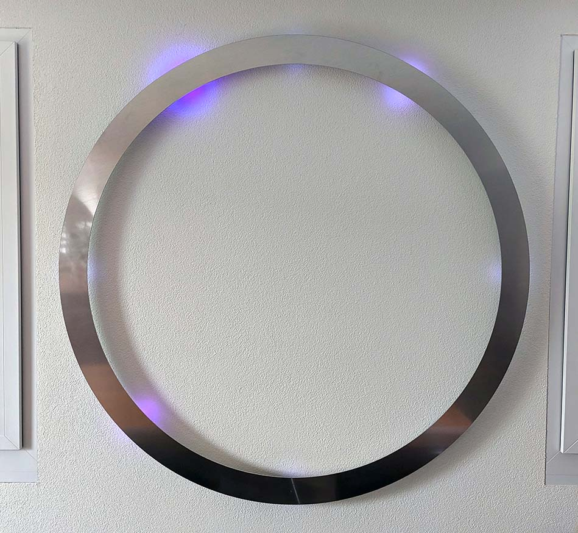
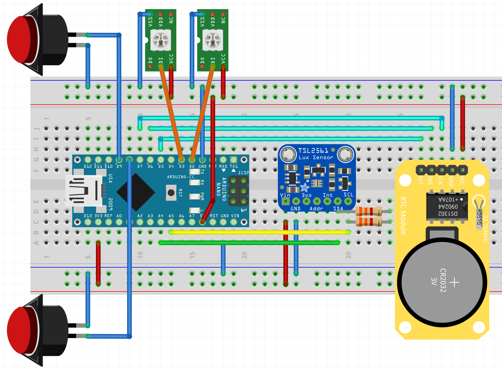
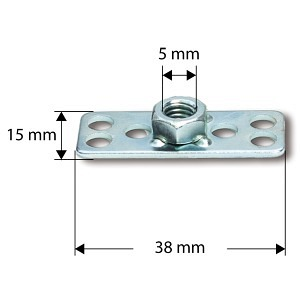
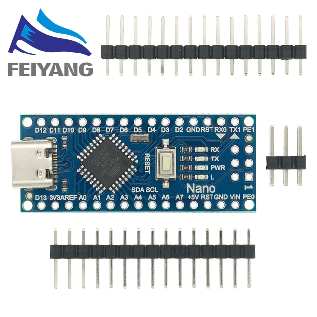
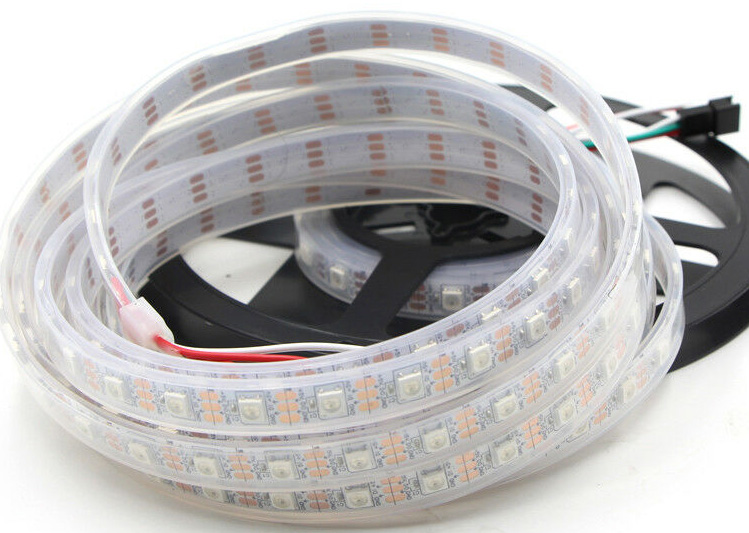
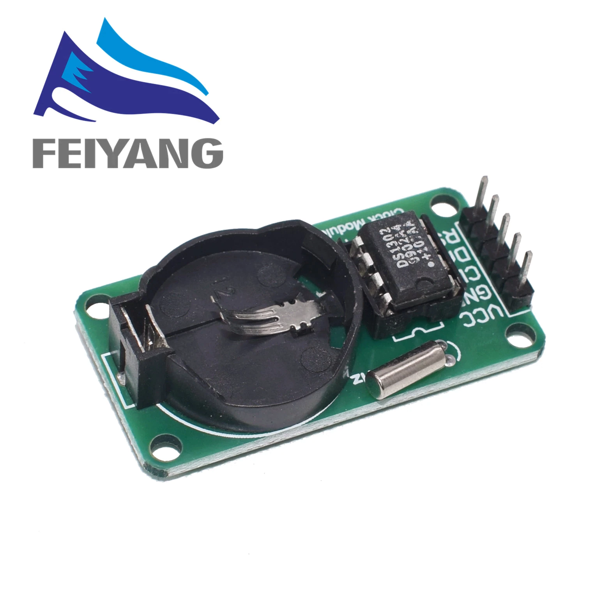
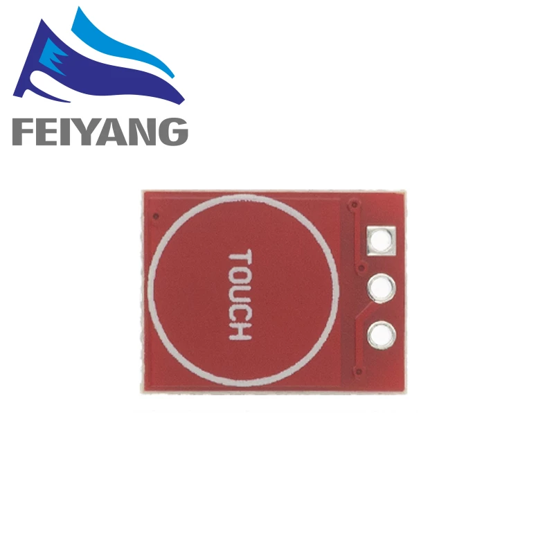
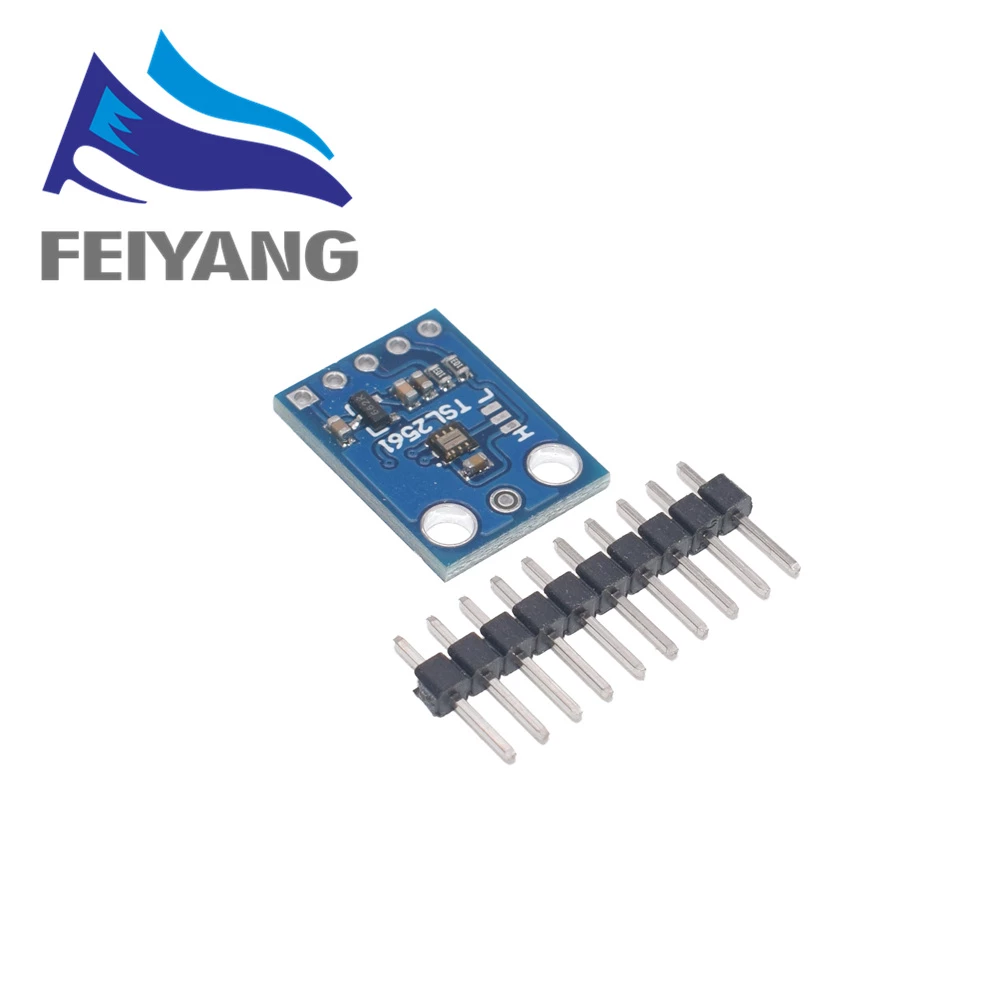

This project builds a Clock with RGB LED's araged on a large circle showing current time.

Clock showing 10:05 and 36 seconds.

It uses an Arduino Nano with Real Time Clock (RTC) and WS2811/WS2812 LED strip to display time. Ambient light sensor helps to have the right light during daytime or night.

# Overview
The images below show the main parts of the system.

| Button Mounted | Top View of Circuit | Side View of circuit |
| ---            | ---                 |   ---                |
|  |  |  |

## Circuit
The following circuit was drawn with Fritzing and is located in [`circuit/led_clock.fzz`](./circuit/led_clock.fzz) folder. 

## Mechanical Components
| Item | Supplier - Partnumber | Image | Details |
| ---  | ---                   | ---   | ---     |
| Spacer for wall mounting | abstandshalter.com - 1.100.536 (50mm) |  | [Link](https://www.abstandshalter.com/wandabstandshalter/buchstabenbefestigung/schriften-befestigung-gewinde-edelstahl-oe-13x50mm-distanzhuelse-v2a) |
| Composite mounting | Suter Kunststoffe AG - 491.5203 (15x38mm, M5) |  | [Link](https://shop.swiss-composite.ch/pi.php/Formenbau/Composite-Muttern-Schrauben/Composite-Mutter-INOX-M-5-38x15mm-pStk.html) |

## Electrical Components
| Item | Supplier - Partnumber | Image | Details |
| ---  | ---                   | ---   | ---     |
| Arduino Nano | Aliexpress - Arduino Nano V3.0 (ATmega328) |  | [Datasheet](datasheet/NanoV3.0_ATmega328_ali.pdf) |
| LED Stip | Aliexpress - "1m 2m 4m 5m WS2812B Led Lights WS2812 RGB Led Strip Light Individually Addressable Led Light Strip" |  | [Datasheet](datasheet/led_WS2812B.pdf)
| RTC DS1302 | Aliexpress - "RTC DS1302 Real Time Clock Modul for Arduino" |  | -
| Button TTP223 | Aliexpress - "TTP223 Touch Key / Touching Button Module" |  | -
| Ambient Sensor TSL2561 | Aliexpress - "GY-2561 TSL2561 Light Sensor Breakout Infrared Light Sensor Module" |  | -

## Code
The project can be compiled by using the [Arduino App](https://www.arduino.cc/download) or by using 
[CLion](https://www.jetbrains.com/clion/). This is why the project folder contains all the CMake files.

### Libraries
For controlling the LEDs, communicating with the RTC or getting ambient light the following libraries are used:
 - [TSL2561 Light Sensor](https://github.com/adafruit/TSL2561-Arduino-Library)
 - [DS1302 RTC](https://github.com/msparks/arduino-ds1302)
 - [WS2812B RGB LED](https://github.com/adafruit/Adafruit_NeoPixel)
 
 All libraries are directly located in the `src/` directory.
 
### Time Compesation
As my arduino has a verry inaccurate clock, the millis function return the wrong values.
In my case one minute tages 36'733 millis instead of 60000.
I need to multiply all millis() by 1.63
